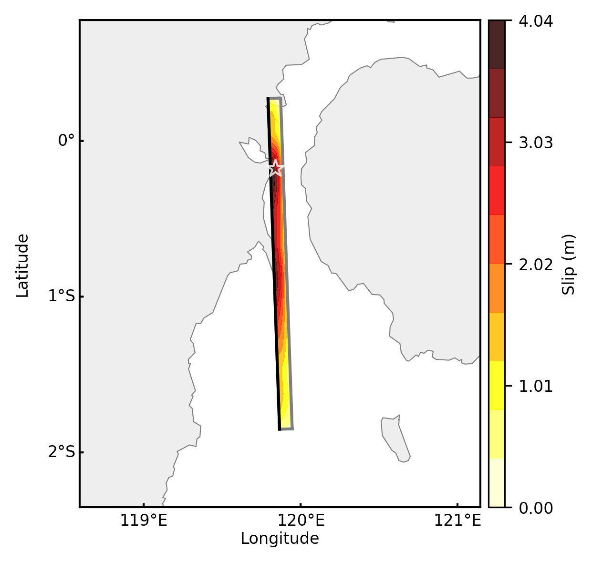
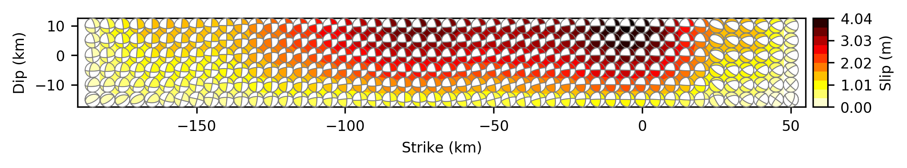
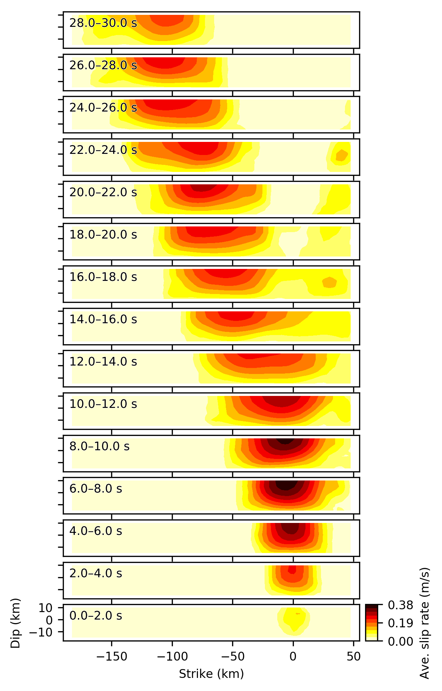
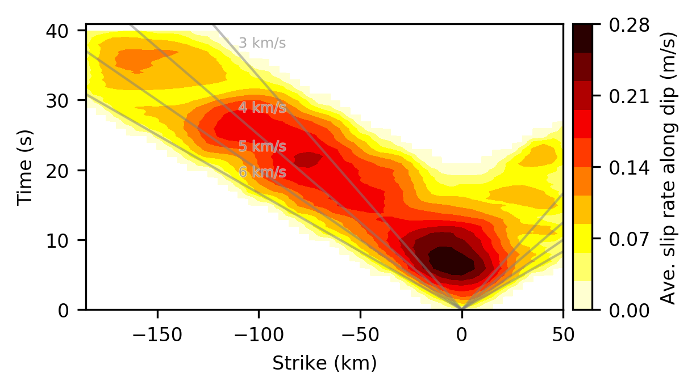
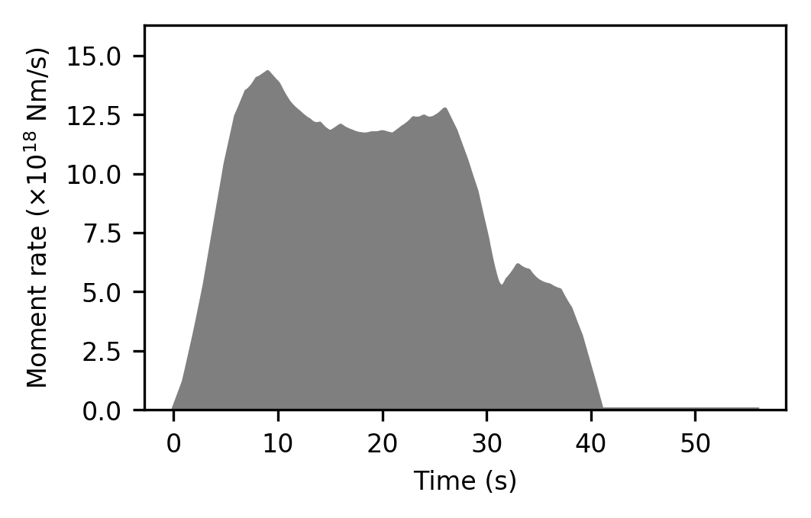

# Rupture process of the 2018 Palu, Indonesia, earthquake

- This repository stores the preliminary source model of the Mw 7.6 2018 Palu, Indonesia, earthquake.

- Model builders: [Ryo Okuwaki](https://rokuwaki.github.io), [Yuji Yagi](http://www.geol.tsukuba.ac.jp/~yagi-y/eng/index.html), and Kousuke Shimizu (University of Tsukuba)

- Updated on 2018-10-22 16:34:47JST

  - Finer grid intervals: 5 km x 5 km along strike and dip
  - Looser constraints: Max. rupture velocity at 6 km/s, longer rise time, wider possible rupture area further south of Palu bay

# Data

- Teleseismic body waves at 49 stations, downloaded via [IRIS-DMC](http://ds.iris.edu/wilber3/find_event), were used for constructing the source model.
  - [SAC files](./sacfiles): initial phases were manually picked and labeled as AMARKERs.

- The epicenter (0.178°S, 119.840°E) determined by [USGS NEIC](https://earthquake.usgs.gov/earthquakes/eventpage/us1000h3p4/executive) was adopted for the initial rupture point for constructing the source model.

# Source model

- We estimated the spatiotemporal distribution of the moment tensor solutions by using the extended framework of Yagi and Fukahata (2011, GJI, doi:[10.1111/j.1365-246X.2011.05043.x](https://doi.org/10.1111/j.1365-246X.2011.05043.x)). The detailed description for the methodology is in preparation for submission (Shimizu et al.).

- What we provide here is the distribution of the slip and the preferred nodal plane (strike, dip, and rake). We extracted the double couple components from the moment tensor solutions, and selected the preferred nodal planes that are consistent with the local tectonic setting (Bellier et al., 2001, TerraNova, doi:[10.1046/j.1365-3121.2001.00382.x](https://doi.org/10.1046/j.1365-3121.2001.00382.x)). We used a model plane with a strike 358° and dip 69°, but we solved the moment tensor for each source node on the model plane, i.e., we did not assume fault geometry for each source node. We set the maximum rupture velocity at 6.0 km/s, accounting for a possibility of supershear-rupture propagation.

- [`./model_181022013638/FFM_DCpreferred.txt`](./model_181022013638/FFM_DCpreferred.txt)

  - Slip distribution with focal mechanism for each source node  
        - `No`: Number of node  
        - `D0`: Slip amplitude in meter  
        - `lonR`: Longitude of node in degree  
        - `latR`: Latitude of node in degree  
        - `dR`: Depth of node in km  
        - `L`: Length of subfault in km  
        - `W`: Width of subfault in km  
        - `strike`: Preferred strike angle of node in degree  
        - `dip`: Preferred dip angle of node in degree  
        - `rake`: Preferred rake angle of node in degree  
        - `x`: Location along strike from the hypocenter in km  
        - `y`: Location along dip from the hypocenter in km  

- [`./model_181022013638/slip_along_strike.txt`](./model_181022013638/slip_along_strike.txt)

  - Slip distribution along strike

- [`./model_181022013638/snap_*.txt`](./model_181022013638/)
  
  - Snapshots of slip rate distribution at 2 sec. interval (

- [`./model_181022013638/slip-rate-time_along_strike.txt`](./model_181022013638/slip-rate-time_along_strike.txt)

  - Temporal evolution of slip rate along strike

- [`./model_181022013638/st_181022013638.dat`](./model_181022013638/st_181022013638.dat)

  - Moment-rate function

*[Note!] Beach ball is plotted using a lower-hemisphere stereographic projection*

