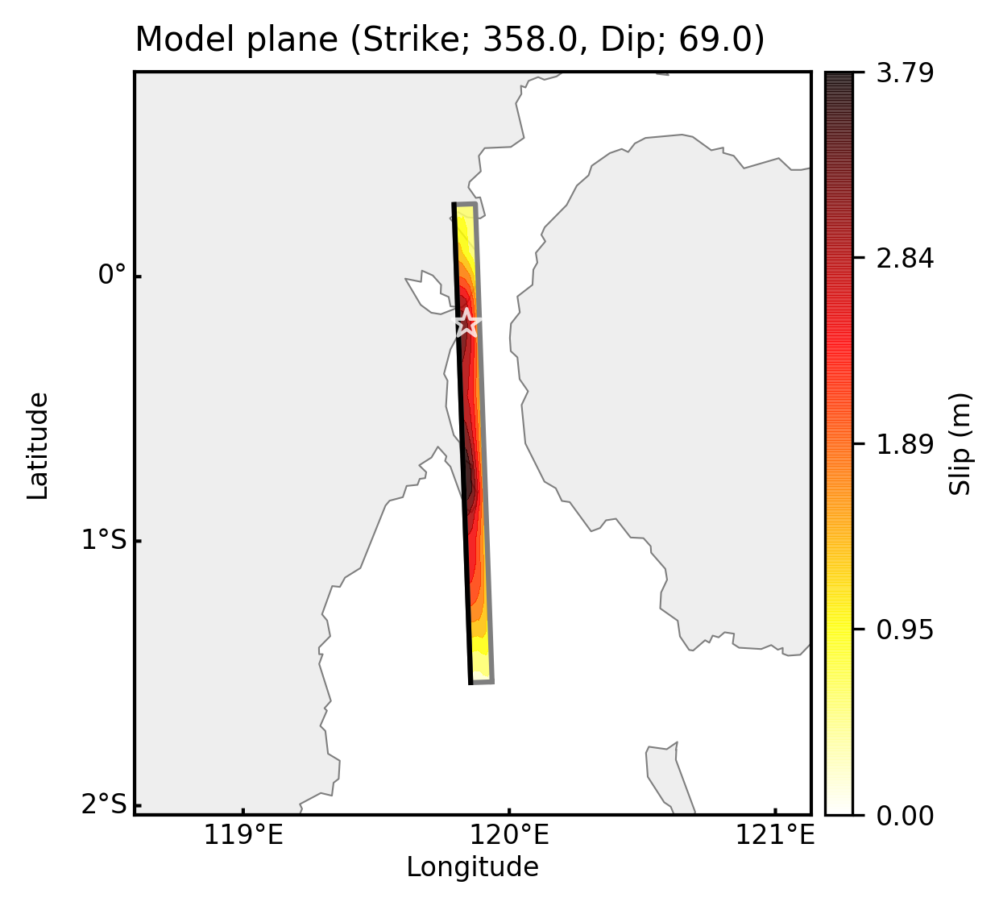
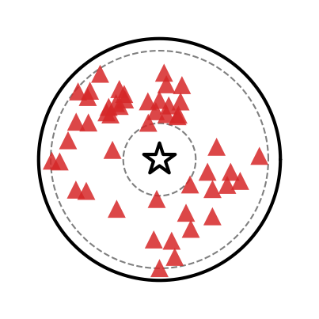
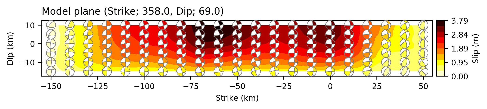
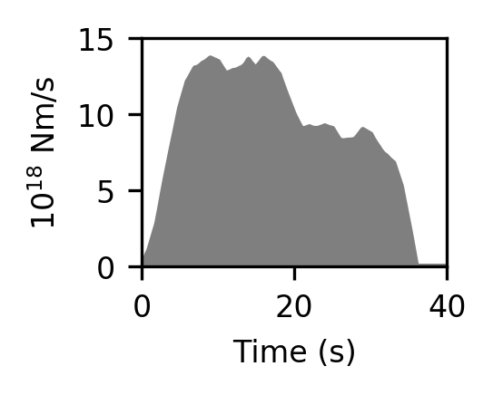
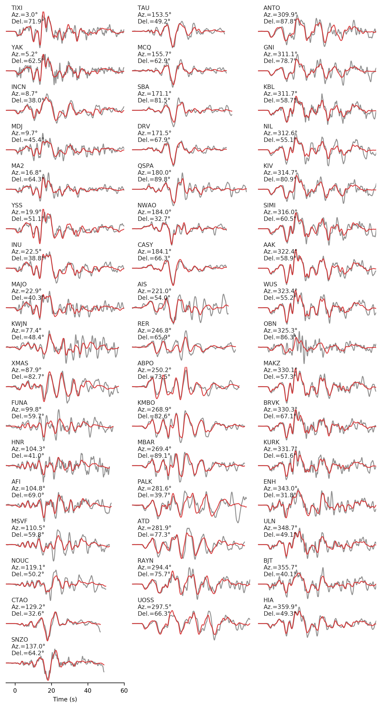

[](https://zenodo.org/badge/latestdoi/153305275)

# 2018PaluIndonesia

- This repository stores the preliminary source model of the Mw 7.6 2018 Palu, Indonesia, earthquake.

- Model builders:

    - [Ryo Okuwaki](mailto:rokuwaki@gmail.com), Yuji Yagi, and Kousuke Shimizu (University of Tsukuba)




# Data

- Teleseismic body waves at 51 stations, downloaded via [IRIS-DMC](http://ds.iris.edu/wilber3/find_event), were used for constructing the source model.



- [SAC files](./sacfiles)

    -  Initial phases were manually picked and labeled as AMARKER.


- The epicenter (0.178°S, 119.840°E) determined by [USGS NEIC](https://earthquake.usgs.gov/earthquakes/eventpage/us1000h3p4/executive) was adopted for the initial rupture point for the source model.


# Source model

- We estimated the spatiotemporal distribution of the moment tensor solutions by using the extended framework of Yagi and Fukahata (2011, GJI, doi:[10.1111/j.1365-246X.2011.05043.x](https://doi.org/10.1111/j.1365-246X.2011.05043.x)). The detailed description for the methodology is in preparation for submission (Shimizu et al.).

- What we provide here is the distribution of the slip and the preferred nodal plane (strike, dip, and rake). We extracted the double couple components from the moment tensor solutions, and selected the preferred nodal planes that are consistent with the local tectonic setting (Bellier et al., 2001, TerraNova, doi:[10.1046/j.1365-3121.2001.00382.x](https://doi.org/10.1046/j.1365-3121.2001.00382.x)).

- We set the maximum rupture velocity at 4.5 km/s, accounting for a possibility of supershear-rupture propagation.

- [LonLatDepSlipDCprefered2018SulawesiIndonesia.txt](./model_181017122702/LonLatDepSlipDCprefered2018SulawesiIndonesia.txt)

```txt
No        D0           lonR           latR             dR         L         W    strike       dip      rake         x         y
   1     0.183     119.935257      -1.532030      26.003710     10.00      5.00     8.622    80.163    44.902   -150.00    -15.00
   2     0.470     119.932129      -1.441650      26.003710     10.00      5.00     7.926    88.326    49.995   -140.00    -15.00
   3     0.679     119.928993      -1.351270      26.003710     10.00      5.00     3.994    81.466    26.286   -130.00    -15.00
   :
   :
   :
 126     0.490     119.792168       0.272780       2.664200     10.00      5.00     2.753    57.716    71.736     50.00     10.00
```

- `No`: Number of node
- `D0`: Slip amplitude in meter
- `lonR`: Longitude of node in degree
- `latR`: Latitude of node in degree
- `dR`: Depth of node in km
- `L`: Length of subfault in km
- `W`: Width of subfault in km
- `strike`: Preferred strike angle of node in degree
- `dip`: Preferred dip angle of node in degree
- `rake`: Preferred rake angle of node in degree
- `x`: Location along strike from the hypocenter in km
- `y`: Location along dip from the hypocenter in km

- Strike-dip view of the result



*Note! Beach ball is plotted using a lower-hemisphere stereographic projection*

- [Moment-rate function](./model_181017122702/st_181017122702.dat)



- Waveform fitting


