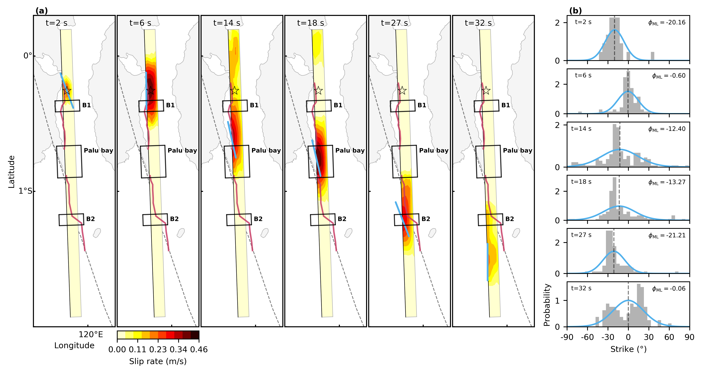

# Inchworm-like source evolution through a geometrically complex fault fueled persistent supershear rupture during the 2018 Palu Indonesia earthquake
<p align=""><a href="https://www.geol.tsukuba.ac.jp/~rokuwaki/">Ryo Okuwaki</a>, <a href="http://interfacial.jp">Shiro Hirano</a>, <a href="http://www.geol.tsukuba.ac.jp/~yagi-y/eng/index.html">Yuji Yagi</a> & Kousuke Shimizu
<p align="center"></p>


## Citation
```bibtex
@article{Okuwaki2020,
author = {Okuwaki, Ryo and Hirano, Shiro and Yagi, Yuji and Shimizu, Kousuke},
doi = {10.31223/osf.io/j4cas},
journal = {EarthArXiv},
month = {feb},
pages = {1--16},
title = {{Inchworm-like source evolution through a geometrically complex fault fueled persistent supershear rupture during the 2018 Palu Indonesia earthquake}},
url = {https://eartharxiv.org/j4cas/},
year = {2020}
}
```

## Preprint
A non-peer reviewed preprint is available at [doi: 10.31223/osf.io/j4cas](https://doi.org/10.31223/osf.io/j4cas), powered by [EarthArXiv](https://eartharxiv.org).

## Supplementary material
[Supplementary material](https://osf.io/v35uj/) contains 4 texts, 1 table, 11 figures, and [1 movie](./pubFigure/movieS1.mp4).

## Figures
All the figures presented in the manuscript can be retrieved via [Jupyter notebook](https://nbviewer.jupyter.org/github/rokuwaki/2018PaluIndonesia/blob/master/genFigure.ipynb).
